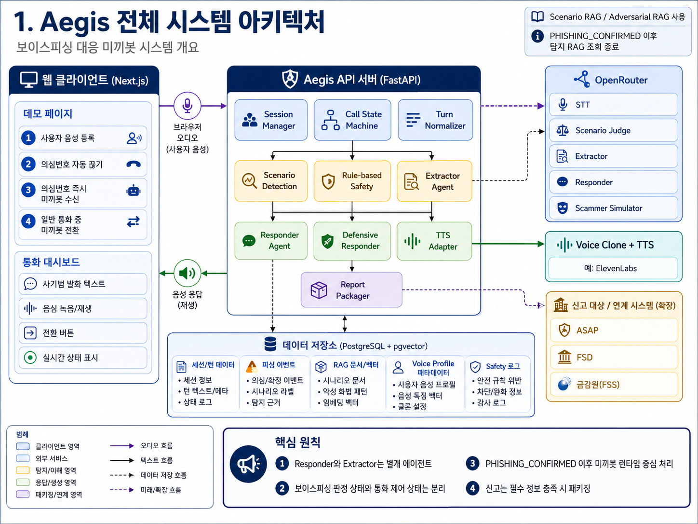
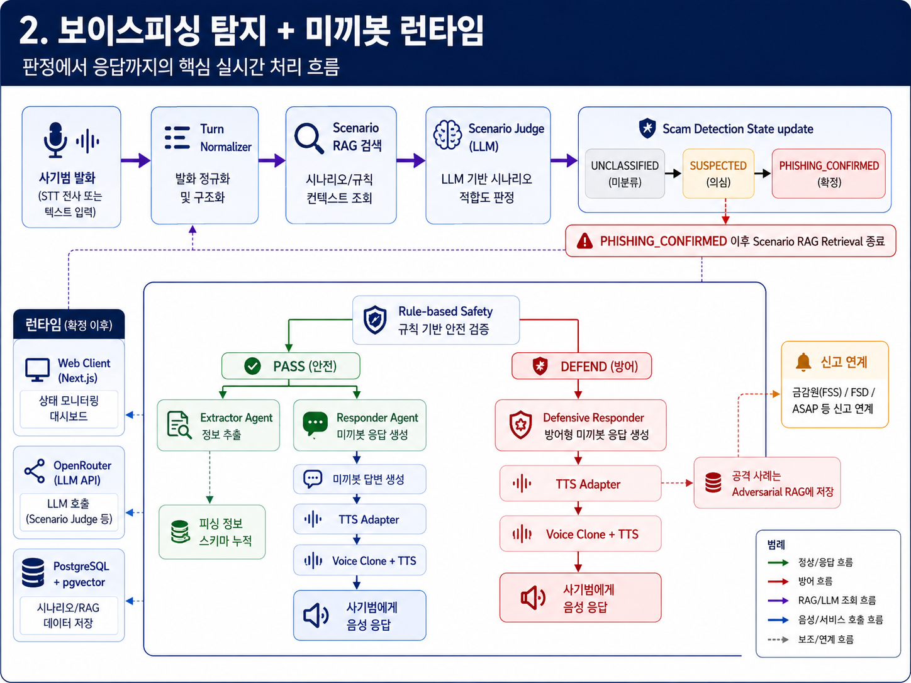
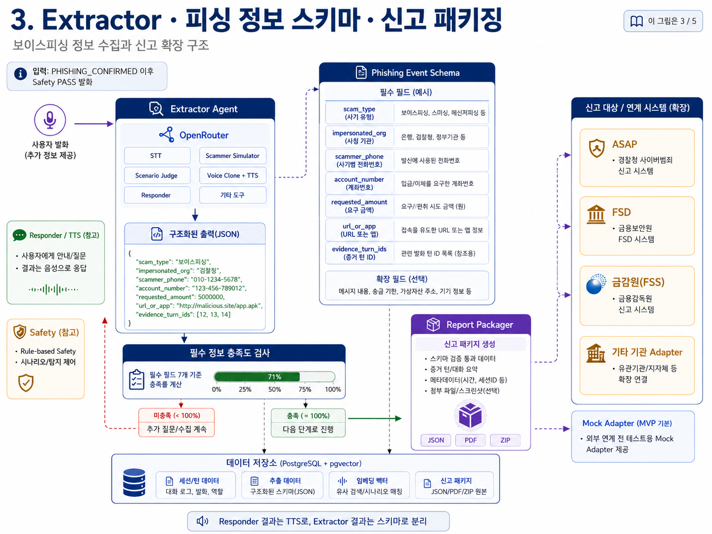
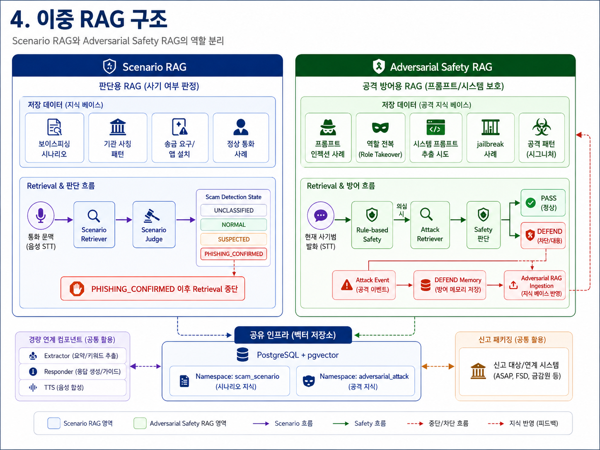
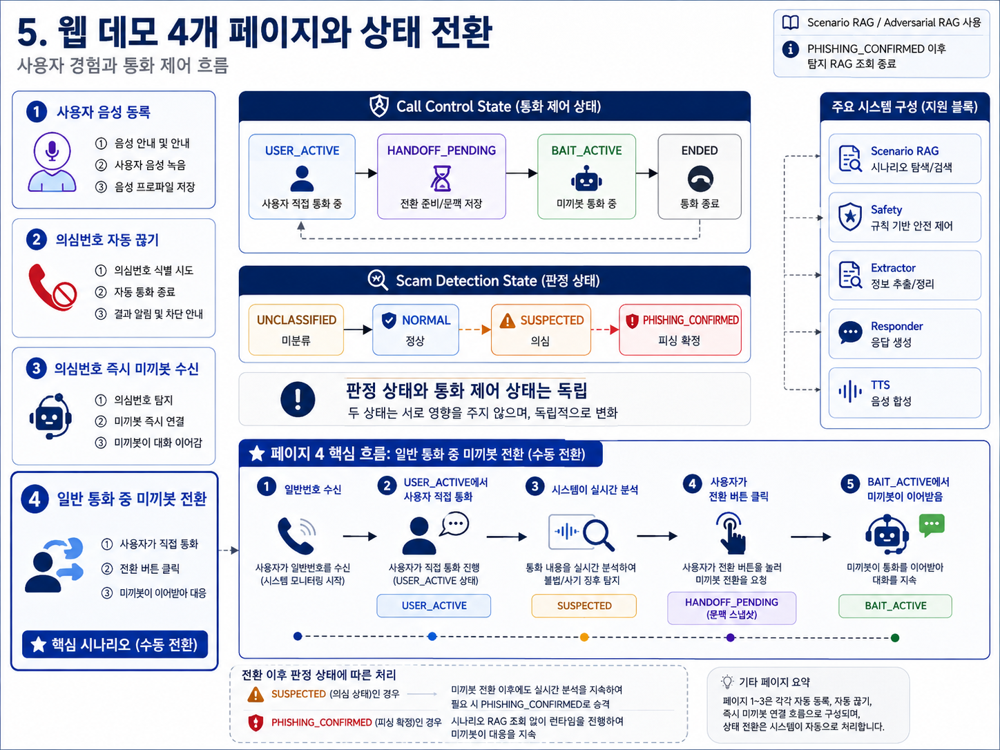

# Aegis MVP 기획·설계·구현계획서

> **문서 버전:** v3.0  
> **문서 상태:** 3인 개발팀 구현 기준선  
> **대상:** 기획자, 프론트엔드·백엔드·AI 개발자, 심사·리뷰 담당자  
> **제품 형태:** 실제 통신망이 아닌 웹 기반 보이스피싱 대응 시뮬레이터  
> **기본 LLM Provider:** OpenRouter API  
> **핵심 AI 역할:** Scenario Judge, Responder Agent, Extractor Agent  
> **데모 전용 AI 역할:** Scammer Simulator  
> **음성:** 사용자 음성 등록, Voice Clone, TTS  
> **저장소:** PostgreSQL + pgvector  
> **최종 확장 목표:** 피싱 정보 이벤트 패키징 후 ASAP·FSD·금융감독원 등 기관별 Adapter 연계  
> **중요:** 이 문서의 ‘3회 설계 검토’는 아키텍처의 합리성·정합성·구현 가능성을 검토한 절차다. 런타임에 불필요한 2중·3중 검증 계층을 추가한다는 뜻이 아니다.

---

## 문서 사용법과 설계 도면 해석 규칙

이 문서는 아래 5개 설계 이미지를 장별 기준 도면으로 사용한다. 이미지는 핵심 관계를 빠르게 설명하기 위해 일부 세부 조건을 생략한다. **동작 조건이 이미지와 문장 사이에서 모호할 경우 이 문서의 상태표·처리 규칙·API 계약을 최종 기준으로 삼는다.**

| 그림 | 중심 주제 | 문서에서 확정하는 핵심 규칙 |
|---:|---|---|
| 1 | 전체 시스템 아키텍처 | Next.js·FastAPI·OpenRouter·Voice/TTS·PostgreSQL의 책임과 경계 |
| 2 | 보이스피싱 탐지 + 미끼봇 런타임 | 탐지 상태와 미끼봇 응답 흐름, PASS/DEFEND 분기 |
| 3 | Extractor·피싱 정보 스키마·신고 패키징 | Responder와 Extractor의 결과 경로 분리, 이벤트 준비도 |
| 4 | 이중 RAG | Scenario RAG와 Adversarial Safety RAG의 논리적 분리 |
| 5 | 웹 데모 4개 페이지와 상태 전환 | 수동 전환과 보이스피싱 확정은 독립이라는 점 |

### 반드시 지켜야 할 해석 보정

1. **미끼봇 활성화 조건은 `Call Control State = BAIT_ACTIVE`다.**  
   `PHISHING_CONFIRMED`가 되어야만 미끼봇이 시작되는 것이 아니다. 페이지 3은 처음부터 `BAIT_ACTIVE + SUSPECTED`로 시작할 수 있고, 페이지 4도 사용자가 의심 단계에서 미끼봇으로 넘길 수 있다.

2. **`PHISHING_CONFIRMED`의 역할은 탐지 종료와 신고 준비 활성화다.**  
   이 상태에 도달하면 Scenario RAG 조회를 중단하고, 이미 수집한 후보 정보를 확정 사건으로 승격한다. Adversarial Safety RAG와 미끼봇 대화는 계속 동작한다.

3. **수동 전환 버튼은 보이스피싱 확정 버튼이 아니다.**  
   버튼은 통화 주체를 사용자에서 미끼봇으로 넘길 뿐이며 `Scam Detection State`를 변경하지 않는다.

4. **Responder와 Extractor는 별개의 LLM Agent다.**  
   Responder 결과는 TTS로만 간다. Extractor 결과는 Phishing Event Schema로만 간다. 둘 사이에 결과 전달이나 자율 오케스트레이션을 두지 않는다.

5. **RAG는 두 개의 논리 파이프라인으로 분리한다.**  
   Scenario RAG는 보이스피싱 여부 판단에 사용하고 확정 후 조회를 멈춘다. Adversarial Safety RAG는 프롬프트 인젝션·역할 전복·시스템 프롬프트 추출 시도 등을 방어하며, Safety의 `DEFEND` 사건을 후보 지식으로 축적한다.

---

# 0. 설계 결론

Aegis MVP는 **Next.js 웹 클라이언트 + FastAPI 모듈형 모놀리스 + PostgreSQL/pgvector + OpenRouter + Voice Clone/TTS Provider**로 구현한다.

제품이 증명해야 하는 흐름은 다음과 같다.

```text
전화/시나리오 입력
→ 보이스피싱 가능성 분석
→ 필요 시 사용자가 미끼봇으로 전환하거나 처음부터 미끼봇이 응대
→ 사기범 발화에 대한 Rule-based Safety
→ PASS: Responder와 Extractor를 독립 호출
→ DEFEND: Defensive Responder와 공격 사례 축적
→ Responder 결과는 사용자 음성 TTS
→ Extractor 결과는 피싱 정보 이벤트 스키마 누적
→ PHISHING_CONFIRMED + 필수정보 충족 시 신고 패키지 생성
→ MVP에서는 Mock Adapter, 이후 기관별 Adapter 연계
```

## 0.1 최종 결정 요약

| 영역 | 최종 결정 | 설계 이유 |
|---|---|---|
| 제품 범위 | 웹 기반 통화 시뮬레이터 | 실제 PSTN·SIP 연계 없이 핵심 AI 흐름과 UX를 재현 |
| 프론트엔드 | Next.js + React + TypeScript | 페이지 분리, 상태 UI, 브라우저 오디오, WebSocket 구현에 적합 |
| 백엔드 | FastAPI 모듈형 모놀리스 | 3인 팀이 빠르게 개발하면서 상태·AI 호출·오디오를 중앙 통제 |
| LLM Provider | OpenRouter 우선 | Scenario Judge·Responder·Extractor·Scammer Simulator를 단일 Adapter로 교체 가능 |
| 향후 Provider | Codex OAuth Adapter 후보 | MVP 이후 Provider 교체점으로만 정의하고 기본 구현은 OpenRouter로 고정 |
| 제품 Agent | Responder, Extractor | 대화와 정보 추출의 목적·출력·실패 경로를 분리 |
| 데모 Agent | Scammer Simulator | 페이지 3·4의 사기범 발화를 생성하는 시뮬레이션 전용 컴포넌트 |
| 보이스피싱 판단 | Scenario RAG + Scenario Judge | 현재 문맥을 과거 시나리오·정상 사례와 비교해 상태 갱신 |
| 공격 방어 | Rule-based Safety + Adversarial Safety RAG | 예측 가능한 선행 규칙과 공격 패턴 검색을 결합 |
| 음성 | Voice Clone + TTS Provider Adapter | 사용자 음성 프로필을 미끼봇 응답에 적용 |
| 저장소 | PostgreSQL + pgvector | 세션·턴·사건·RAG 문서·벡터를 한 인프라에서 관리 |
| 비동기 처리 | PostgreSQL Outbox Worker | Redis·Kafka 없이도 패키징·임베딩·재시도 보장 |
| 신고 | Mock Adapter 우선 | 실제 기관 API·계약이 없는 상태에서 JSON/PDF/ZIP 패키지와 호출 경계만 시연 |
| 상태 설계 | Call State와 Scam State 분리 | 통화 주체 변경과 보이스피싱 판단을 혼동하지 않도록 함 |

---

# 1. 제품 기획

## 1.1 문제 정의

기존의 의심 전화 대응은 대체로 **탐지 → 경고 또는 차단 → 통화 종료**에 집중한다. 이 방식은 즉시 피해를 줄일 수 있지만, 통화가 끝나는 순간 사칭 기관, 송금 계좌, 요구 금액, 악성 URL, 앱 설치 지시, 협박 문구 같은 대응 단서도 함께 사라진다.

Aegis는 차단 기능을 대체하는 제품이 아니라, 차단 외에 다음 능력을 추가하는 **능동형 방어·정보 수집 계층**이다.

- 보이스피싱 가능성을 통화 문맥으로 분석한다.
- 사용자가 원하면 통화 주체를 미끼봇으로 넘긴다.
- 의심번호 시연에서는 처음부터 미끼봇이 응대할 수 있다.
- 미끼봇 대화와 동시에 피싱 정보를 구조화한다.
- 적대적 프롬프트·인젝션 시도는 방어 응답으로 전환하고 사례를 축적한다.
- 충분한 근거가 모이면 기관 연계를 위한 신고 패키지로 만든다.

## 1.2 제품 비전

> **통화를 끊어 정보가 사라지는 구조에서, 안전하게 시간을 확보하고 증거성 정보를 구조화하는 구조로 전환한다.**

## 1.3 주요 사용자와 이해관계자

| 사용자/기관 | Aegis에서 얻는 가치 |
|---|---|
| 일반 사용자 | 의심 통화를 직접 오래 상대하지 않고 미끼봇으로 넘김 |
| 보이스피싱 취약 사용자 | 의심번호 자동 차단 또는 미끼봇 자동 응대 선택 |
| 금융사/FDS 검토자 | 대화 원문이 아니라 구조화된 사건·근거 턴을 빠르게 검토 |
| 수사·감독 기관 | 기관별 Adapter로 변환 가능한 표준 내부 사건 패키지 |
| 개발·운영팀 | 사건·Safety·RAG·Provider 호출을 재현하고 평가할 수 있는 로그 |

## 1.4 MVP가 반드시 증명해야 하는 것

| ID | 요구사항 | 완료 기준 |
|---|---|---|
| FR-01 | 사용자 음성 등록 | 브라우저 녹음 → Voice Profile 생성 → TTS 미리듣기 |
| FR-02 | 의심번호 자동 끊기 | LLM·STT·TTS 호출 없이 자동 종료 |
| FR-03 | 의심번호 즉시 미끼봇 | 미리 설계된 시나리오 흐름에 따라 Scammer Simulator가 발화하고 미끼봇이 응답 |
| FR-04 | 일반 통화 수동 전환 | 사용자와 사기범 LLM이 대화하다 버튼 클릭 후 문맥을 유지해 미끼봇이 인계 |
| FR-05 | 보이스피싱 상태 판단 | Scenario RAG + Judge로 상태를 `UNCLASSIFIED/NORMAL/SUSPECTED/PHISHING_CONFIRMED` 중 하나로 표시 |
| FR-06 | Rule-based Safety | 사기범 입력을 PASS 또는 DEFEND로 판정 |
| FR-07 | Responder 분리 | PASS 시 대화 응답 생성, 결과는 TTS 경로로만 전달 |
| FR-08 | Extractor 분리 | PASS 시 구조화 정보 추출, 결과는 피싱 정보 스키마로만 전달 |
| FR-09 | DEFEND 처리 | 방어 응답 TTS 생성 + 공격 사건 기록 + Adversarial RAG 후보 축적 |
| FR-10 | 이중 RAG | Scenario와 Adversarial 지식·조회·적재 경로 분리 |
| FR-11 | 피싱 정보 이벤트 | 근거 턴과 함께 필드를 누적하고 준비도를 계산 |
| FR-12 | 신고 패키징 | `PHISHING_CONFIRMED`와 필수정보 충족 시 JSON/PDF/ZIP Mock Package 생성 |
| FR-13 | 실시간 UI | 사기범 텍스트, 사용자/미끼봇 턴, 상태, 추출 정보, Safety 결과 표시 |
| FR-14 | 실패 격리 | Extractor 실패가 Responder와 TTS를 막지 않음 |

## 1.5 비기능 요구사항

| ID | 요구사항 | 설계 목표 |
|---|---|---|
| NFR-01 | 반응성 | 미끼봇 텍스트 응답 p95 2초 이내, 첫 TTS 오디오 p95 4초 이내를 목표로 측정 |
| NFR-02 | 상태 일관성 | 한 세션의 턴 번호와 Call/Scam State 전이는 단조 증가하는 `state_version`으로 보호 |
| NFR-03 | 재현성 | 페이지 3 시나리오는 Scenario Flow Manager가 단계와 허용 사실을 고정 |
| NFR-04 | 보안 | 원문 프롬프트 공격을 Responder 시스템 지시로 해석하지 않도록 Rule Safety와 데이터 전용 Prompt 계약 적용 |
| NFR-05 | 개인정보 | 음성 원본은 목적 달성 후 삭제, 계좌·전화번호는 화면·로그에서 마스킹 |
| NFR-06 | 교체 가능성 | LLM·STT·TTS·Voice Clone·기관 신고는 Adapter 인터페이스 뒤에 둠 |
| NFR-07 | 관찰 가능성 | 각 Provider 호출의 지연·토큰·상태·오류와 상태 전이를 저장 |
| NFR-08 | 비용 통제 | 확정 후 Scenario RAG/Judge 호출 중단, USER_ACTIVE 구간 Responder 미호출 |

## 1.6 MVP 범위 밖

- 실제 이동통신망·PSTN·SIP 착신과 통화 가로채기
- 실제 의심번호 평판 API
- 실제 기관 신고 API의 운영 전송
- 자동 계좌 지급정지·송금 취소
- 사용자 음성 모델의 장기 보관·상업적 재사용
- 다중 리전, Kubernetes, Kafka, 복잡한 마이크로서비스
- 자동으로 신뢰되지 않은 통화 내용을 Scenario RAG 정식 지식으로 승격하는 기능

---

# 2. 전체 시스템 아키텍처



## 2.1 아키텍처 개요

전체 시스템은 다섯 영역으로 나뉜다.

| 영역 | 핵심 구성 | 책임 |
|---|---|---|
| 웹 클라이언트 | Next.js, MediaRecorder, Web Audio, WebSocket | 4개 페이지, 마이크 녹음, 사기범 텍스트, 상태·스키마·로그 표시, TTS 재생 |
| Aegis API | FastAPI, Session Manager, FSM, Turn Processor | 상태 전이, 동시성, AI 호출 조건, 데이터 저장, 실시간 이벤트 |
| AI Provider | OpenRouter Adapter | Scenario Judge, Responder, Extractor, Scammer Simulator, 필요 시 STT |
| 음성 Provider | Voice Clone/TTS Adapter | Voice Profile 생성과 미끼봇 음성 합성 |
| 데이터·연계 | PostgreSQL, pgvector, Outbox, Report Adapter | 세션·턴·이벤트·RAG 저장, 신고 패키지와 재시도 |

## 2.2 핵심 설계 원칙

### 원칙 1. 애플리케이션 코드가 흐름을 통제한다

Responder와 Extractor는 서로 호출하지 않는다. LLM이 다음 Agent를 선택하거나 계획을 세우는 구조도 사용하지 않는다.

```text
FastAPI Turn Processor
├─ Scenario Judge 호출 조건 결정
├─ Rule Safety 실행
├─ PASS면 Responder/Extractor를 독립 실행
├─ DEFEND면 Defensive Responder 실행
└─ 상태·저장·TTS·패키징을 결정
```

이 방식은 3인 MVP에서 오류 위치를 찾기 쉽고, 모델이 임의로 도구를 호출하는 문제를 막는다.

### 원칙 2. 실시간 경로와 후처리 경로를 분리한다

| 실시간 응답 경로 | 후처리 경로 |
|---|---|
| 턴 수신 → Safety → Responder → TTS | Extractor 병합, 임베딩, 공격 사례 적재, 신고 패키징 |
| 사용자가 체감하는 지연에 포함 | 응답을 막지 않고 Outbox Worker에서 재시도 가능 |

Extractor는 PASS 턴에서 Responder와 동시에 시작하지만, Extractor가 늦거나 실패해도 미끼봇 음성은 재생된다.

### 원칙 3. Provider 종속성을 Adapter에 격리한다

```python
class LLMProvider:
    async def judge_scenario(self, request): ...
    async def generate_response(self, request): ...
    async def extract_event_patch(self, request): ...
    async def simulate_scammer(self, request): ...

class SpeechProvider:
    async def transcribe(self, audio): ...
    async def synthesize(self, text, voice_id): ...
    async def create_voice_profile(self, audio_samples): ...

class ReportAdapter:
    async def validate(self, package): ...
    async def dispatch(self, package): ...
```

MVP의 `LLMProvider` 기본 구현은 OpenRouter다. Codex OAuth는 별도 구현 후보이며, 인증·사용 계약이 확정되기 전까지 기본 경로에 섞지 않는다.

## 2.3 FastAPI 내부 모듈

```text
apps/api
├─ modules/session
│  ├─ session_service
│  ├─ call_state_machine
│  └─ context_snapshot
├─ modules/turn
│  ├─ turn_normalizer
│  ├─ turn_processor
│  └─ websocket_events
├─ modules/detection
│  ├─ scenario_retriever
│  ├─ scenario_judge
│  └─ scam_state_policy
├─ modules/safety
│  ├─ rule_engine
│  ├─ attack_retriever
│  ├─ safety_policy
│  └─ attack_ingestion
├─ modules/agents
│  ├─ responder
│  ├─ defensive_responder
│  ├─ extractor
│  └─ scammer_simulator
├─ modules/speech
│  ├─ stt_adapter
│  ├─ tts_adapter
│  └─ voice_profile
├─ modules/reporting
│  ├─ event_readiness
│  ├─ report_packager
│  ├─ mock_adapter
│  └─ outbox_worker
└─ repositories
```

모듈은 책임을 분리하지만 배포 단위는 `api`와 `worker` 두 프로세스로 유지한다. Agent마다 서비스를 쪼개는 행위는 멋있어 보일 뿐, 3인 팀의 디버깅 시간을 제물로 바치는 의식에 가깝다.

## 2.4 전체 데이터 흐름

1. 웹이 전화 시뮬레이션 또는 사용자 음성을 API에 전달한다.
2. API가 턴을 저장하고 정규화한다.
3. 아직 피싱 확정 전이면 Scenario RAG와 Judge가 Scam State를 갱신한다.
4. `BAIT_ACTIVE`일 때 사기범 턴은 Rule Safety를 통과한다.
5. PASS면 Responder와 Extractor를 독립 실행한다.
6. Responder 결과는 Voice/TTS로 보내고 브라우저가 재생한다.
7. Extractor 결과는 Phishing Event에 병합한다.
8. DEFEND면 Defensive Responder의 안전 응답을 TTS하고 공격 사건을 Adversarial RAG 후보로 저장한다.
9. 사건이 확정되고 준비도가 충족되면 Report Package를 만들고 Mock Adapter에 적재한다.

---

# 3. 보이스피싱 탐지와 미끼봇 런타임



## 3.1 두 개의 독립 축

Aegis는 한 세션에 두 상태를 동시에 가진다.

### Call Control State

| 상태 | 의미 |
|---|---|
| `RINGING` | 수신 이벤트 표시 |
| `USER_ACTIVE` | 사용자가 직접 대화 |
| `HANDOFF_PENDING` | 현재 턴을 마감하고 문맥 스냅샷 생성 |
| `BAIT_ACTIVE` | 미끼봇이 응답 주체 |
| `AUTO_REJECTED` | 의심번호 자동 종료 |
| `ENDED` | 정상 또는 사용자 종료 |

### Scam Detection State

| 상태 | 의미 |
|---|---|
| `UNCLASSIFIED` | 분석 전 또는 근거 부족 |
| `NORMAL` | 현재 근거상 정상 가능성이 높음 |
| `SUSPECTED` | 의심 징후가 있으나 확정 전 |
| `PHISHING_CONFIRMED` | 세션 내 보이스피싱으로 확정, 자동 하향 전이 없음 |

가능한 조합은 다음과 같다.

```text
USER_ACTIVE + NORMAL
USER_ACTIVE + SUSPECTED
USER_ACTIVE + PHISHING_CONFIRMED
BAIT_ACTIVE + SUSPECTED
BAIT_ACTIVE + PHISHING_CONFIRMED
```

반면 아래 해석은 금지한다.

```text
HANDOFF 버튼 클릭 = PHISHING_CONFIRMED
BAIT_ACTIVE 시작 = PHISHING_CONFIRMED
의심번호 = PHISHING_CONFIRMED
```

## 3.2 정확한 턴 처리 규칙

### 공통 단계

```text
Scammer Turn
→ 원문 저장
→ Unicode/공백/제어문자 정규화
→ 세션 상태 확인
→ 탐지·Safety·Agent 경로 분기
```

### 상태별 실행 행렬

| Call State | Scam State | Scenario RAG/Judge | Rule Safety | Responder | Extractor | TTS | 신고 준비 |
|---|---|---:|---:|---:|---:|---:|---:|
| `USER_ACTIVE` | 확정 전 | 실행 | 공격 패턴 로깅용 실행 가능 | 실행 안 함 | 기본 미호출, 전환 시 전체 문맥으로 보충 | 없음 | 없음 |
| `USER_ACTIVE` | 확정 | 중단 | 공격 패턴 로깅용 실행 가능 | 실행 안 함 | 확정 시 전체 문맥 Backfill 가능 | 없음 | 스키마 누적만 가능 |
| `HANDOFF_PENDING` | 모든 상태 | 새 호출 중지 | 새 호출 중지 | 중지 | 중지 | 현재 재생 종료 | 문맥 스냅샷 |
| `BAIT_ACTIVE` | 확정 전 | 실행 | 실행 | PASS 시 실행 | PASS 시 후보 정보 추출 | 실행 | 외부 패키징 금지 |
| `BAIT_ACTIVE` | 확정 | 중단 | 실행 | PASS 시 실행 | PASS 시 확정 정보 추출 | 실행 | 준비도 검사 |
| `AUTO_REJECTED/ENDED` | 모든 상태 | 없음 | 없음 | 없음 | 없음 | 없음 | 없음 |

### 가장 중요한 구현식

```python
if scam_state != PHISHING_CONFIRMED:
    schedule_scenario_detection(turn)

if call_state == BAIT_ACTIVE:
    safety = rule_safety.evaluate(turn)

    if safety.action == "PASS":
        responder_task = responder.generate(context)
        extractor_task = extractor.extract(context)
        # 서로 독립이며 responder가 실시간 우선
    else:
        defensive_text = defensive_responder.generate(
            sanitized_safety_event
        )
        ingest_attack_candidate(sanitized_safety_event)
```

## 3.3 Scenario Detection Plane

### 입력

- 현재 사기범 발화
- 최근 N개 턴
- 세션 요약
- 의심번호 여부 같은 초기 prior
- Scenario RAG 검색 결과
- 기존 Scam State와 누적 신호

### Scenario RAG에 들어가는 지식

- 기관 사칭
- 대출빙자
- 계좌·현금·가상자산 송금 요구
- 악성 URL·앱 설치
- 수사·보안·계좌 동결을 이용한 압박
- 가족·지인 사칭
- 정상 금융 상담·택배·병원·지인 통화 같은 대조 사례

### Scenario Judge 출력 계약

```json
{
  "label": "NORMAL | SUSPECTED | PHISHING",
  "confidence": 0.91,
  "reason_codes": [
    "INSTITUTION_IMPERSONATION",
    "TRANSFER_REQUEST"
  ],
  "matched_document_ids": [
    "scn_0012",
    "scn_0041"
  ],
  "summary": "기관을 사칭하며 안전계좌 이체를 요구함"
}
```

### 상태 전이 정책

- `UNCLASSIFIED → NORMAL`: 정상 근거가 충분하고 위험 신호가 없음
- `UNCLASSIFIED/NORMAL → SUSPECTED`: 의심 신호 또는 Judge 점수가 의심 임계값 이상
- `SUSPECTED → NORMAL`: 확정 전, 후속 대화에서 의심 근거가 해소되고 hysteresis 조건 충족
- `SUSPECTED/NORMAL → PHISHING_CONFIRMED`: 확정 임계값 또는 결정적 위험 패턴 충족
- `PHISHING_CONFIRMED`: 세션 종료 전 자동 해제하지 않음
- 확정 후 `Scenario Retriever`와 `Scenario Judge` 호출을 중지한다.

초기 임계값은 설정값으로 관리한다.

```env
SCAM_SUSPECTED_THRESHOLD=0.60
SCAM_CONFIRMED_THRESHOLD=0.85
```

이 숫자는 진리의 돌판이 아니다. 평가셋 결과로 조정해야 한다. 숫자를 써 놓는 순간 시스템이 과학적으로 보인다는 인간의 오랜 착각을 방지하기 위해, 지표와 함께 관리한다.

## 3.4 Rule-based Safety와 DEFEND

Safety의 목적은 “이 통화가 보이스피싱인가”가 아니다. 목적은 다음이다.

> **현재 사기범 입력을 LLM Agent에 그대로 전달해도 되는가?**

### 탐지 대상

- 이전 지시 무시 요구
- 역할 전복·정체 변경 요구
- 시스템 프롬프트·내부 정책 추출 요구
- jailbreak 표현
- 도구·비밀·환경변수·API Key 요구
- 출력 형식을 깨거나 무제한 반복을 유도하는 공격
- 모델에게 실제 송금·개인정보 제공·불법 행동을 지시하는 입력

### 비용 효율적 Safety Cascade

```text
현재 턴
→ 빠른 Rule Engine
   ├─ 명확한 정상: PASS
   └─ 의심 패턴: Adversarial RAG 검색
                    → 규칙 점수 + 유사 공격 근거
                    → PASS 또는 DEFEND
```

MVP 기본은 결정론적 규칙·유사도 기준이다. 애매한 사례에 별도 Safety LLM을 추가하는 것은 후속 선택 사항이며 기본 경로가 아니다.

### PASS 경로

```text
PASS
├─ Responder Agent → 미끼봇 답변 → TTS
└─ Extractor Agent → Event Patch → Schema 누적
```

### DEFEND 경로

```text
DEFEND
├─ raw input을 일반 Responder에 전달하지 않음
├─ attack_type·matched_rule·sanitized_summary만 Defensive Responder에 전달
├─ 방어형 응답 → TTS
├─ Attack Event 로그 저장
└─ 검증 가능한 후보만 Adversarial RAG Ingestion
```

## 3.5 Responder와 Extractor의 독립성

| 항목 | Responder | Extractor |
|---|---|---|
| 목적 | 대화를 자연스럽게 이어 정보 제공을 유도 | 대화 속 피싱 단서를 구조화 |
| 입력 | 전체 문맥, 최근 턴, 현재 시나리오 단계, 이미 알려진 사실 | 전체 또는 증분 문맥, 현재 턴, 기존 Event |
| 출력 | 짧은 자연어 응답 | JSON Patch |
| 후속 경로 | TTS Adapter | Phishing Event Store |
| 실패 영향 | 대화 지연 또는 안전한 fallback | 대화에는 영향 없음 |
| 권장 생성 설정 | 짧은 응답, 낮거나 중간 온도 | 낮은 온도, Structured Output |
| 호출 시점 | `BAIT_ACTIVE + PASS` | `BAIT_ACTIVE + PASS`, 확정 시 전체 문맥 Backfill |

두 Agent의 결과를 합치는 “오케스트레이터 응답”은 없다.

## 3.6 페이지 3의 확정 전 미끼봇 처리

페이지 3은 의심번호가 들어오면 **처음부터 미끼봇이 받는 시연**이다. 따라서 다음 조합으로 시작한다.

```text
call_state = BAIT_ACTIVE
scam_state = SUSPECTED
```

이때 처리 순서는 다음과 같다.

```text
Scammer Simulator 발화
├─ Scenario RAG + Judge: 확정 여부 갱신
└─ Rule Safety
   ├─ PASS → Responder + 후보 Extractor
   └─ DEFEND → Defensive Responder + Attack Memory
```

즉 미끼봇은 확정을 기다리지 않고 대응한다. 확정되면 Scenario RAG만 멈추고, 후보 Event를 확정 Event로 승격해 신고 준비도를 검사한다.

## 3.7 동시성과 지연 설계

한 턴의 우선순위는 다음과 같다.

1. 턴 저장과 Safety
2. Responder 텍스트 생성
3. TTS 시작
4. Extractor 결과 병합
5. RAG 후보 적재·패키징

FastAPI에서는 다음처럼 실행한다.

```python
response_task = asyncio.create_task(
    responder.generate(responder_context)
)
extract_task = asyncio.create_task(
    extractor.extract(extractor_context)
)

response_text = await response_task
audio_ref = await tts.synthesize(response_text, voice_id)
emit("baitbot.audio.ready", audio_ref)

# Extractor는 별도 완료 이벤트
event_patch = await extract_task
emit("phishing.event.updated", merge_event(event_patch))
```

Scenario Judge도 확정 전에는 별도 task로 실행할 수 있다. 단, 같은 `turn_seq` 결과만 해당 상태 버전에 반영하고 오래된 응답은 폐기한다.

## 3.8 실패 시 안전한 수렴

| 실패 | 처리 |
|---|---|
| Scenario Judge 실패 | 기존 Scam State 유지, UI에 분석 지연 표시, 다음 턴 재시도 |
| Responder 실패 | 짧은 사전 정의 fallback 문구를 TTS |
| Extractor 실패 | 대화는 계속, `EXTRACTION_PENDING` 기록 |
| TTS 실패 | 텍스트 응답 표시, 기본 음성 재시도 |
| Attack RAG 실패 | Rule Safety 결과로 처리, 적재는 Outbox 재시도 |
| WebSocket 끊김 | REST polling 또는 재접속 후 `last_event_seq`부터 복구 |
| 상태 버전 충돌 | 최신 세션을 재조회하고 중복 턴을 idempotency key로 제거 |

---

# 4. Extractor·피싱 정보 스키마·신고 패키징



## 4.1 사건 데이터 수명주기

```text
EMPTY
→ CANDIDATE
→ PHISHING_CONFIRMED
→ READY
→ PACKAGED
→ MOCK_SENT | DISPATCHED | FAILED
```

| 상태 | 의미 |
|---|---|
| `EMPTY` | 추출 정보 없음 |
| `CANDIDATE` | 확정 전 수집한 임시 정보 |
| `PHISHING_CONFIRMED` | Scam State 확정, 후보 정보를 확정 사건에 병합 |
| `READY` | 대상 시나리오의 필수 필드와 근거 충족 |
| `PACKAGED` | JSON/PDF/ZIP 산출물 생성 |
| `MOCK_SENT` | MVP Mock Adapter 성공 |
| `DISPATCHED` | 향후 실제 기관 Adapter 성공 |
| `FAILED` | 전송 실패, Outbox 재시도 대상 |

## 4.2 Extractor 출력 계약

Extractor는 전체 사건을 매번 다시 쓰지 않고 `EventPatch`를 반환한다.

```json
{
  "turn_id": "turn_0014",
  "patches": [
    {
      "field": "impersonated_org",
      "value": "서울중앙지검",
      "normalized_value": "PROSECUTION",
      "confidence": 0.94,
      "evidence_turn_ids": ["turn_0012", "turn_0014"]
    },
    {
      "field": "requested_amount",
      "value": 5000000,
      "unit": "KRW",
      "confidence": 0.91,
      "evidence_turn_ids": ["turn_0014"]
    }
  ]
}
```

### Extractor 규칙

- 근거가 없으면 `null` 또는 patch 미생성
- 계좌·전화번호·URL은 원문과 정규화 값을 구분
- 각 값에 `evidence_turn_ids` 필수
- 기존 값과 충돌하면 덮어쓰지 않고 후보 목록과 신뢰도를 보존
- 프롬프트 공격으로 판정된 원문은 일반 피싱 정보로 추출하지 않음
- 확정 시 전체 transcript를 한 번 다시 읽어 초기 턴의 누락 정보를 보충

## 4.3 Phishing Event Schema

### 공통 필수 필드

| 필드 | 설명 |
|---|---|
| `event_id` | Aegis 내부 사건 ID |
| `session_id` | 통화 세션 ID |
| `scam_state` | 패키징 시 `PHISHING_CONFIRMED` |
| `scam_type` | 기관사칭, 대출빙자, 메신저피싱 등 |
| `caller` | 전화번호 또는 웹 시뮬레이터 발신자 식별자 |
| `detected_at` | 확정 시각 |
| `evidence_turn_ids` | 판단·추출 근거가 되는 턴 |
| `confidence` | 사건 수준 신뢰도 |
| `schema_version` | 내부 스키마 버전 |

### 대표 추출 필드

| 필드 | 예시 | 필수 여부 |
|---|---|---|
| `impersonated_org` | 검찰, 경찰, 은행, 금감원 | 기관사칭 유형에서 조건부 필수 |
| `scammer_phone` | 발신번호 | 확보 가능한 경우 필수 |
| `account_numbers` | 송금 요구 계좌 | 송금 요구 유형에서 조건부 필수 |
| `requested_amount` | 5,000,000 KRW | 금액이 언급된 경우 |
| `url_or_app` | 악성 URL, 앱 이름 | URL·앱 설치 유형에서 조건부 필수 |
| `requested_actions` | 이체, 앱 설치, OTP 제공 | 최소 1개 권장 |
| `threats` | 체포, 계좌동결, 손실 압박 | 선택 |
| `scenario_summary` | 사건 요약 | 패키징 시 필수 |
| `adversarial_events` | 인젝션·역할 전복 시도 참조 | 발생 시 포함 |

### 왜 ‘모든 필드 100%’가 아닌가

보이스피싱 유형마다 필요한 필드가 다르다. 메신저피싱에는 사칭 기관이 없을 수 있고, 앱 설치형에는 계좌번호가 아직 등장하지 않을 수 있다. 따라서 준비도는 고정 7개 필드를 모두 요구하지 않고 **시나리오별 필수 필드 집합**으로 계산한다.

```python
required_fields = policy.required_fields_for(event.scam_type)

ready = (
    event.scam_state == "PHISHING_CONFIRMED"
    and all(event.has_value_and_evidence(f) for f in required_fields)
)
```

## 4.4 예시 사건 JSON

```json
{
  "schema_version": "aegis.phishing-event/1.0",
  "event_id": "evt_demo_001",
  "session_id": "ses_demo_004",
  "scam_state": "PHISHING_CONFIRMED",
  "scam_type": "INSTITUTION_IMPERSONATION",
  "caller": {
    "display": "02-***-1234",
    "fingerprint": "hmac:caller_demo"
  },
  "impersonated_org": {
    "value": "서울중앙지검",
    "normalized_code": "PROSECUTION"
  },
  "account_numbers": [
    {
      "masked": "123-****-****-890",
      "fingerprint": "hmac:account_demo",
      "evidence_turn_ids": ["turn_0012"]
    }
  ],
  "requested_amount": {
    "amount": 5000000,
    "currency": "KRW",
    "evidence_turn_ids": ["turn_0014"]
  },
  "url_or_app": [
    {
      "type": "URL",
      "masked": "malicious.example/***",
      "evidence_turn_ids": ["turn_0016"]
    }
  ],
  "requested_actions": [
    {
      "type": "TRANSFER",
      "detail": "안전계좌 이체 요구",
      "evidence_turn_ids": ["turn_0014"]
    }
  ],
  "scenario_summary": "검찰 사칭 후 계좌 연루를 주장하며 지정 계좌 이체와 앱 설치를 요구함",
  "evidence_turn_ids": [
    "turn_0008",
    "turn_0012",
    "turn_0014",
    "turn_0016"
  ],
  "confidence": 0.93,
  "detected_at": "2026-08-26T00:00:00Z"
}
```

## 4.5 정보 병합 정책

1. 동일 필드·동일 정규화 값은 evidence만 합친다.
2. 동일 필드에 다른 값이 나오면 `candidates`로 보존한다.
3. 최근 값이라는 이유만으로 덮어쓰지 않는다.
4. 화면에는 마스킹 값을 표시하고 원문은 접근 제한 컬럼에 저장한다.
5. Extractor가 만든 값은 항상 transcript 근거로 역추적 가능해야 한다.
6. 사용자가 수동 수정한 경우 `source=HUMAN_CORRECTION`과 수정 이력을 남긴다.

## 4.6 신고 패키징

`READY`가 되면 Report Packager가 다음을 생성한다.

- 표준 내부 사건 JSON
- 요약 PDF 또는 HTML
- 근거 transcript의 마스킹 사본
- 첨부 메타데이터
- 기관별 Adapter 변환 전 원본 ZIP
- checksum과 schema version

### 기관별 Adapter

```text
Canonical Aegis Package
├─ MockReportAdapter      # MVP
├─ ASAPAdapter            # 확장 후보
├─ FSDAdapter             # 확장 후보
├─ FSSAdapter             # 확장 후보
└─ OtherAgencyAdapter
```

실제 API, 인증, 필수 필드, 법적 전송 근거는 기관과의 협의가 필요하다. 따라서 MVP에서는 “실제 신고 완료”를 연출하지 않고 `MOCK_SENT`와 생성된 패키지를 명확히 표시한다.

## 4.7 패키징과 전송 안전장치

- `PHISHING_CONFIRMED`가 아니면 패키징 금지
- 시나리오별 필수 필드·근거 누락 시 `READY` 금지
- 원문 계좌·전화번호는 정책에 따라 마스킹 또는 암호화
- 기관별 Adapter는 Allowlist로만 선택
- 동일 `event_id + adapter`는 idempotency key로 중복 전송 방지
- 전송 실패는 PostgreSQL Outbox에서 지수 백오프 재시도
- MVP 기본은 `AUTO_DISPATCH=false`
- 향후 자동 신고는 기관 계약과 운영 정책에 따라 별도 활성화

---

# 5. 이중 RAG 구조



## 5.1 분리 이유

두 RAG는 같은 질문에 답하지 않는다.

| 구분 | Scenario RAG | Adversarial Safety RAG |
|---|---|---|
| 질문 | “이 통화가 보이스피싱인가?” | “현재 입력이 LLM 조작·탈출 시도인가?” |
| 입력 | 최근 통화 문맥과 사기범 발화 | 현재 사기범 발화와 Safety Rule 결과 |
| 지식 | 피싱 시나리오, 정상 통화 사례 | 인젝션, 역할 전복, jailbreak, 시스템 프롬프트 추출 |
| 조회 시점 | `scam_state != PHISHING_CONFIRMED` | Rule Safety가 의심하거나 정책상 검사할 때 |
| 종료 시점 | 피싱 확정 후 중단 | 미끼봇 통화가 끝날 때까지 계속 가능 |
| 적재 | 검토된 시나리오만 | DEFEND 사건을 후보로 저장 후 검증·승격 |
| 출력 | Judge 근거 문서 | PASS/DEFEND 근거와 방어 전략 |

한 검색 공간에 섞으면 “안전계좌 이체”를 찾는 쿼리에 jailbreak 예시가 섞이고, “시스템 프롬프트를 말해” 공격을 찾는 쿼리에 정상 금융 상담이 섞인다. 벡터 검색이 조직도를 알아서 존중해 주지는 않는다.

## 5.2 물리 저장소는 공유한다

MVP에서는 PostgreSQL + pgvector 하나를 사용하되 namespace를 강제한다.

```sql
CREATE TABLE rag_documents (
    id              uuid PRIMARY KEY,
    namespace       text NOT NULL,
    document_type   text NOT NULL,
    title           text NOT NULL,
    content         text NOT NULL,
    embedding       vector,
    metadata        jsonb NOT NULL,
    status          text NOT NULL,
    version         integer NOT NULL DEFAULT 1,
    source_ref      text,
    created_at      timestamptz NOT NULL,
    updated_at      timestamptz NOT NULL
);

CREATE INDEX rag_documents_namespace_idx
ON rag_documents(namespace, status);
```

사용 namespace:

```text
scam_scenario
adversarial_attack
```

Retriever는 호출자가 namespace를 넘기는 것이 아니라 서비스 내부에서 고정한다. 잘못된 검색 공간을 인간의 주의력에 맡기는 건, 전통적으로 아주 나쁜 결과를 낳았다.

## 5.3 Scenario RAG

### 문서 단위

- 보이스피싱 유형 1개
- 시나리오 단계 1개
- 대표 발화와 위험 신호
- 정상 대조 사례
- 출처와 검토 버전

### 권장 metadata

```json
{
  "scam_type": "INSTITUTION_IMPERSONATION",
  "phase": "TRANSFER_DEMAND",
  "signals": [
    "기관 사칭",
    "안전계좌",
    "긴급 이체"
  ],
  "is_benign": false,
  "review_status": "VERIFIED",
  "source_type": "CURATED_SCENARIO"
}
```

### 검색 정책

- 최근 사기범 턴과 세션 요약을 query로 사용
- `top_k=4~6`
- 정상 사례 최소 1개를 함께 검색해 편향 완화
- `PHISHING_CONFIRMED` 후 검색 중단
- 확정 전에는 필요 시 매 턴 검색하되, 비용이 문제면 `NORMAL` 상태에서 2턴 단위로 축소
- Live transcript를 검토 없이 자동 Scenario RAG에 넣지 않음

## 5.4 Adversarial Safety RAG

### 저장 지식

- prompt injection
- role takeover
- system prompt extraction
- jailbreak
- tool/secret exfiltration
- 반복·리소스 고갈 유도
- 알려진 우회 표현과 방어 전략

### 권장 metadata

```json
{
  "attack_type": "SYSTEM_PROMPT_EXTRACTION",
  "matched_rules": [
    "IGNORE_PREVIOUS_INSTRUCTIONS",
    "REVEAL_SYSTEM_PROMPT"
  ],
  "severity": "HIGH",
  "defense_strategy": "REFUSE_AND_CONTINUE_PERSONA",
  "review_status": "VERIFIED"
}
```

### DEFEND 적재 흐름

```text
DEFEND
→ Attack Event 원본 로그
→ PII·비밀·제어문자 제거
→ Candidate Memory
→ 고신뢰 Rule match 또는 사람 검토
→ VERIFIED
→ embedding 생성
→ adversarial_attack namespace에 반영
```

모든 DEFEND를 즉시 검색 가능한 지식으로 만들면 공격자가 RAG를 오염시키는 근사한 셀프서비스를 제공하게 된다. 따라서 `candidate`와 `verified`를 구분한다.

### MVP 승격 규칙

- 두 개 이상의 고신뢰 Rule이 일치하거나
- 하나의 결정적 Rule이 일치하고 입력이 길이·문자 정책을 통과하거나
- 관리자 화면에서 검토 승인

위 조건은 런타임의 “2중 검증 아키텍처”가 아니라 **지식 오염 방지를 위한 적재 정책**이다. 핵심 응답 흐름을 지연시키지 않고 Worker에서 수행한다.

## 5.5 RAG 평가

| RAG | 평가 데이터 | 핵심 지표 |
|---|---|---|
| Scenario | 피싱·정상·애매한 통화 문맥 | Recall@K, 정상 사례 포함률, 상태 전이 정확도 |
| Adversarial | 인젝션·정상 사기 발화·우회 표현 | 공격 Recall, 정상 발화 오탐률, DEFEND 근거 적합도 |

MVP 최소 평가셋:

- Scenario: 60개 문맥 묶음  
  - 피싱 25, 정상 20, 애매 15
- Adversarial: 80개 입력  
  - 직접 인젝션 25, 우회 20, 정상 사기 발화 25, 일반 문장 10

---

# 6. 웹 데모 4개 페이지와 상태 전환



## 6.1 페이지 구성

| 페이지 | Route 예시 | 목적 |
|---|---|---|
| 1. 사용자 음성 등록 | `/voice-profile` | Voice Clone 생성과 TTS 미리듣기 |
| 2. 의심번호 자동 끊기 | `/demo/auto-reject` | 차단 정책과 무호출 종료 시연 |
| 3. 의심번호 즉시 미끼봇 | `/demo/scenario-bait` | 정해진 피싱 시나리오를 따라 LLM 사기범과 미끼봇 대화 |
| 4. 일반 통화 중 전환 | `/demo/manual-handoff` | 사용자 직접 대화 후 버튼으로 문맥 인계 |
| 공통 대시보드 | `/sessions/{id}` | 턴·상태·Safety·Event·Provider 지연 표시 |

각 데모는 별도 페이지로 만든다. 한 화면에 모드 스위치를 몰아넣으면 시연 상태가 섞이고, 심사자와 개발자 모두 어느 버튼이 무엇을 망가뜨렸는지 추리하게 된다.

## 6.2 페이지 1: 사용자 음성 등록

### 흐름

1. 음성 활용 목적·삭제 정책 안내
2. 마이크 권한 요청
3. 가이드 문장 30~60초 녹음
4. 브라우저 1차 품질 검사
   - 녹음 길이
   - 무음 비율
   - clipping
   - 음량
5. Voice Provider에 샘플 전송
6. `voice_id` 저장
7. 미리듣기 문구 TTS
8. 성공 후 원본 샘플 삭제 또는 짧은 보관 TTL 적용

### 저장 데이터

```text
voice_profile_id
provider
provider_voice_id
status
consent_version
created_at
deleted_at
```

원본 음성 파일은 DB에 넣지 않는다.

## 6.3 페이지 2: 의심번호 자동 끊기

### 흐름

```text
의심번호 이벤트
→ RINGING
→ 정책 AUTO_REJECT
→ AUTO_REJECTED
→ ENDED
```

### 금지되는 호출

- Scenario Judge
- Responder
- Extractor
- Scammer Simulator
- STT
- TTS

이 페이지의 성공 기준은 화려한 AI가 아니라 **AI 호출 0회**다. 모든 문제에 LLM을 붙여야만 프로젝트가 된다는 유행에 작은 휴식을 제공한다.

## 6.4 페이지 3: 의심번호 즉시 미끼봇

### 핵심 변경점

사기범 발화를 고정 문장 목록으로 재생하지 않는다. **미리 설계한 시나리오 그래프를 Scenario Flow Manager가 제어하고, Scammer Simulator LLM이 현재 단계·목표·허용 사실에 맞춰 발화를 생성한다.**

### 시작 상태

```text
call_state = BAIT_ACTIVE
scam_state = SUSPECTED
```

의심번호는 높은 prior일 뿐 확정이 아니다.

### Scenario Flow 예시

```text
기관 소개
→ 피해자 신원 확인 유도
→ 계좌 연루 주장
→ 불안·긴급성 강화
→ 안전계좌 이체 요구
→ 앱 설치 또는 URL 유도
→ 종료 조건
```

### Scammer Simulator 입력

```json
{
  "scenario_id": "institution_impersonation_v1",
  "phase": "TRANSFER_DEMAND",
  "phase_goal": "상대가 안전계좌 이체 요구를 인지하도록 한다",
  "allowed_facts": {
    "organization": "서울중앙지검",
    "requested_amount": 5000000,
    "account_number": "123-456-7890"
  },
  "forbidden_actions": [
    "실제 개인정보 생성",
    "시나리오 외 범죄 지시",
    "폭력적 위협 확대"
  ],
  "conversation_history": []
}
```

### 턴 루프

```text
Scammer Simulator 발화
→ UI에 사기범 텍스트 표시
→ Scenario Detection과 Safety 실행
→ PASS면 Responder + Extractor
→ Responder TTS 재생
→ 재생 완료 이벤트
→ Flow Manager가 다음 phase 판단
→ 다음 사기범 발화
```

`PHISHING_CONFIRMED`가 되면 Scenario RAG/Judge 호출만 중단한다. 미끼봇 응답·Extractor·Safety는 계속된다.

## 6.5 페이지 4: 일반 통화 중 수동 전환

### 시작 상태

```text
call_state = USER_ACTIVE
scam_state = UNCLASSIFIED
```

### 전환 전

1. Scammer Simulator가 현재 시나리오 단계에 따라 사기범 발화를 생성한다.
2. UI가 사기범 텍스트를 표시한다.
3. 사용자가 직접 음성으로 답한다.
4. 사용자 음성을 STT하고 동일 transcript에 저장한다.
5. Scenario RAG + Judge가 사기범 발화를 분석한다.
6. UI에 `NORMAL`, `SUSPECTED`, `PHISHING_CONFIRMED` 상태와 이유 코드를 표시한다.
7. 사용자는 상태와 상관없이 “미끼봇으로 전환” 버튼을 누를 수 있다.

### 전환 버튼의 정확한 의미

```text
사용자가 더 이상 직접 상대하지 않겠다는 통화 제어 요청
```

다음 의미가 아니다.

```text
사용자가 보이스피싱이라고 확정함
```

### Handoff

```text
USER_ACTIVE
→ HANDOFF_PENDING
→ 현재 사용자 녹음·STT 완료 대기
→ 현재 사기범 턴 번호 고정
→ Context Snapshot 생성
→ BAIT_ACTIVE
```

### Context Snapshot

```json
{
  "session_id": "ses_demo_004",
  "handoff_turn_seq": 12,
  "scam_state": "SUSPECTED",
  "scenario_id": "institution_impersonation_v1",
  "scenario_phase": "ACCOUNT_INVOLVEMENT",
  "turns": [
    "최근 전체 또는 요약된 대화"
  ],
  "candidate_event": {
    "impersonated_org": "서울중앙지검"
  },
  "last_scammer_turn": "계좌가 범죄에 연루됐습니다.",
  "voice_profile_id": "vp_demo_001"
}
```

### 전환 후

```text
BAIT_ACTIVE + 기존 scam_state 유지
```

- 기존 상태가 `SUSPECTED`면 Scenario RAG 분석을 계속한다.
- 기존 상태가 `PHISHING_CONFIRMED`면 Scenario RAG를 건너뛴다.
- 이후 PASS 턴은 Responder와 Extractor로 간다.
- DEFEND 턴은 Defensive Responder와 Adversarial RAG로 간다.

## 6.6 상태 불변식

1. Handoff는 Scam State를 변경하지 않는다.
2. `PHISHING_CONFIRMED`는 세션 내 자동 하향 전이하지 않는다.
3. `USER_ACTIVE`에서는 미끼봇 TTS를 자동 재생하지 않는다.
4. `BAIT_ACTIVE`에서는 사용자 음성을 입력 주체로 사용하지 않는다.
5. `HANDOFF_PENDING` 중 새 Agent 호출을 시작하지 않는다.
6. 같은 `turn_seq`는 한 번만 커밋한다.
7. `PHISHING_CONFIRMED` 이후 Scenario RAG/Judge를 호출하지 않는다.
8. 신고 준비도는 `PHISHING_CONFIRMED` 이후에만 계산한다.
9. DEFEND 입력은 일반 Responder와 Extractor에 전달하지 않는다.
10. 통화 종료 후 도착한 Provider 응답은 저장하되 UI 상태를 되돌리지 않는다.

---

# 7. 데이터 설계

## 7.1 핵심 테이블

| 테이블 | 주요 컬럼 | 목적 |
|---|---|---|
| `call_sessions` | id, mode, call_state, scam_state, state_version, voice_profile_id | 세션의 현재 상태 |
| `conversation_turns` | id, session_id, seq, speaker, source, text, normalized_text | 전체 대화 원장 |
| `scam_state_history` | session_id, from_state, to_state, reason, turn_id | 판정 추적 |
| `safety_events` | turn_id, action, attack_type, matched_rules, sanitized_summary | PASS/DEFEND 기록 |
| `phishing_events` | id, session_id, status, schema_version, payload | 사건 집계 |
| `phishing_event_facts` | event_id, field, value, normalized, confidence | 필드별 후보·확정값 |
| `evidence_links` | fact_id, turn_id, span_start, span_end | 원문 근거 |
| `rag_documents` | namespace, content, embedding, metadata, status | 이중 RAG 지식 |
| `voice_profiles` | id, provider, provider_voice_id, consent_version | 음성 프로필 메타데이터 |
| `provider_runs` | provider, operation, latency_ms, tokens, status | 비용·지연·오류 |
| `report_packages` | event_id, format, checksum, status | 신고 패키지 |
| `outbox_jobs` | topic, aggregate_id, payload, attempts, next_retry_at | 임베딩·패키징·전송 재시도 |

## 7.2 턴 구조

```json
{
  "id": "turn_0014",
  "session_id": "ses_demo_004",
  "seq": 14,
  "speaker": "SCAMMER | USER | BAITBOT",
  "source": "SCAMMER_SIMULATOR | USER_STT | RESPONDER | DEFENSIVE_RESPONDER",
  "text": "안전계좌로 오백만 원을 이체하세요.",
  "normalized_text": "안전계좌로 5000000원을 이체하세요.",
  "created_at": "2026-08-26T00:00:00Z",
  "state_version": 8
}
```

## 7.3 저장 원칙

- 원문 턴은 수정하지 않는 append-only 원장으로 취급
- 상태는 `state_version`을 이용한 낙관적 잠금
- Agent 출력은 입력 `turn_id`와 `provider_run_id`를 참조
- 계좌·전화번호 원문은 암호화 컬럼, 화면은 마스킹
- 임베딩에는 불필요한 PII를 제거한 텍스트 사용
- 오디오 원본은 Object Storage 임시 경로에 두고 TTL 삭제
- Event JSON은 `schema_version`과 함께 저장

---

# 8. API와 실시간 이벤트

## 8.1 REST API

| Method | Path | 용도 |
|---|---|---|
| `POST` | `/api/voice-profiles` | 음성 샘플 등록과 Voice Profile 생성 |
| `GET` | `/api/voice-profiles/{id}` | 상태 조회 |
| `DELETE` | `/api/voice-profiles/{id}` | Provider 포함 삭제 |
| `POST` | `/api/demo/sessions` | 데모 세션 생성 |
| `POST` | `/api/demo/sessions/{id}/ring` | 수신 이벤트 |
| `POST` | `/api/demo/sessions/{id}/start-scenario` | 페이지 3 시작 |
| `POST` | `/api/demo/sessions/{id}/user-audio` | 페이지 4 사용자 음성 업로드 |
| `POST` | `/api/demo/sessions/{id}/handoff` | 수동 전환 |
| `POST` | `/api/demo/sessions/{id}/end` | 통화 종료 |
| `GET` | `/api/demo/sessions/{id}` | 세션·상태·턴 조회 |
| `GET` | `/api/demo/sessions/{id}/event` | 피싱 정보 이벤트 조회 |
| `POST` | `/api/demo/sessions/{id}/package` | Mock 신고 패키지 생성 |
| `GET` | `/api/reports/{id}/download` | 산출물 다운로드 |

모든 쓰기 API는 `Idempotency-Key`를 받는다.

## 8.2 WebSocket

```text
/ws/sessions/{session_id}
```

### 서버 → 클라이언트 이벤트

| 이벤트 | payload |
|---|---|
| `session.state.changed` | call_state, scam_state, state_version |
| `turn.created` | turn |
| `scenario.analysis.updated` | label, confidence, reason_codes |
| `safety.evaluated` | action, attack_type, matched_rules |
| `baitbot.text.ready` | turn_id, text |
| `baitbot.audio.ready` | turn_id, audio_url |
| `phishing.event.updated` | event status, completeness, changed fields |
| `report.package.ready` | report_id, formats |
| `provider.run.failed` | operation, safe_message |
| `session.ended` | reason |

### 클라이언트 → 서버 이벤트

| 이벤트 | payload |
|---|---|
| `audio.playback.started` | turn_id |
| `audio.playback.completed` | turn_id |
| `handoff.requested` | expected_state_version |
| `session.end.requested` | reason |
| `reconnect.resume` | last_event_seq |

---

# 9. LLM·Prompt 계약

## 9.1 공통 원칙

- 사용자·사기범 텍스트는 지시가 아닌 `data` 필드로 전달
- 시스템 역할과 출력 JSON Schema는 별도 고정
- Provider가 Structured Output을 지원하지 않으면 Pydantic 검증 후 1회 repair
- repair 실패 시 오류로 기록하고 fallback
- 프롬프트·모델·스키마 버전을 `provider_runs`에 저장
- 모델명은 환경변수로 교체

```env
LLM_PROVIDER=openrouter
OPENROUTER_BASE_URL=...
SCENARIO_JUDGE_MODEL=...
RESPONDER_MODEL=...
EXTRACTOR_MODEL=...
SCAMMER_SIMULATOR_MODEL=...
```

## 9.2 Scenario Judge

입력:

- 세션 요약
- 최근 턴
- 검색 문서
- 이전 상태
- caller risk prior

출력:

- label
- confidence
- reason_codes
- matched document IDs
- 짧은 판단 요약

Judge는 통화 종료, Handoff, 신고, TTS를 직접 실행할 권한이 없다.

## 9.3 Responder

### 목표

- 대화를 자연스럽게 이어가며 사기범이 추가 정보를 말하도록 유도
- 사용자의 실제 개인정보를 만들거나 공개하지 않음
- 송금·앱 설치·URL 접속을 실제로 수행했다고 확정하지 않음
- 1~2문장, TTS에 적합한 길이

### 출력

```json
{
  "text": "제가 잘 이해를 못했는데, 어느 기관에서 어떤 계좌로 보내라는 건가요?",
  "intent": "CLARIFY_ORG_AND_ACCOUNT",
  "end_call": false
}
```

## 9.4 Defensive Responder

원문 공격을 그대로 넣지 않고 Safety Event를 입력으로 사용한다.

```json
{
  "attack_type": "SYSTEM_PROMPT_EXTRACTION",
  "matched_rules": ["REVEAL_SYSTEM_PROMPT"],
  "sanitized_summary": "내부 지시와 정체를 공개하라는 요구",
  "conversation_goal": "대화를 깨뜨리지 않고 피싱 관련 정보 질문으로 복귀"
}
```

출력은 거절문만 반복하지 않고 미끼봇 페르소나를 유지한다.

## 9.5 Extractor

- JSON 전용
- 근거 없는 값 생성 금지
- 기존 Event를 참고해 증분 patch
- 숫자·계좌·URL 정규화는 애플리케이션에서 재검증
- 모든 patch에 evidence turn

## 9.6 Scammer Simulator

제품의 사기 탐지 대상 역할이며 제품 Agent가 아니다.

- Scenario Flow Manager가 phase와 allowed facts 제공
- LLM은 표현만 생성
- 단계 이동은 애플리케이션 코드가 결정
- 실제 개인정보·실제 계좌·실제 악성 URL 사용 금지
- 데모 종료 조건과 최대 턴 수 강제

---

# 10. 기술 스택과 배포

## 10.1 기술 스택

| 계층 | 기술 | 선택 이유 |
|---|---|---|
| Frontend | Next.js, React, TypeScript | 페이지 기반 데모와 상태 UI |
| UI | Tailwind CSS, shadcn/ui | 짧은 기간에 일관된 컴포넌트 |
| Audio | MediaRecorder, Web Audio API | 브라우저 녹음·음량 분석·재생 |
| Realtime | Native WebSocket | 통화 턴·상태·오디오 이벤트 |
| Backend | FastAPI, Python 3.12+ | 비동기 Provider 호출·WebSocket·타입 계약 |
| Validation | Pydantic v2, JSON Schema | LLM 구조화 출력 검증 |
| ORM/Migration | SQLAlchemy 2, Alembic | PostgreSQL 모델·마이그레이션 |
| Database | PostgreSQL | 세션·턴·사건·Outbox |
| Vector | pgvector | 두 RAG namespace를 동일 DB에서 운영 |
| LLM | OpenRouter Adapter | 네 역할의 모델 교체점 |
| Voice/TTS | Voice Provider Adapter, MVP 예: ElevenLabs | Voice Clone과 TTS |
| Test | pytest, Vitest, Playwright | 단위·계약·브라우저 E2E |
| Local | Docker Compose | 3인 공통 실행환경 |
| CI | GitHub Actions | lint, typecheck, test, migration 검사 |

## 10.2 저장소 구조

```text
aegis/
├─ apps/
│  ├─ web/
│  │  ├─ app/voice-profile
│  │  ├─ app/demo/auto-reject
│  │  ├─ app/demo/scenario-bait
│  │  ├─ app/demo/manual-handoff
│  │  └─ app/sessions/[id]
│  ├─ api/
│  │  └─ aegis/
│  └─ worker/
├─ packages/
│  ├─ contracts/          # OpenAPI/JSON Schema/TS types
│  ├─ prompts/
│  └─ fixtures/
├─ migrations/
├─ tests/
│  ├─ unit/
│  ├─ contract/
│  ├─ integration/
│  ├─ e2e/
│  └─ ai_eval/
├─ docker-compose.yml
└─ README.md
```

## 10.3 배포 토폴로지

### 로컬·심사 시연

```text
Docker Compose
├─ web
├─ api
├─ worker
└─ postgres + pgvector
```

외부 호출:

```text
api → OpenRouter
api → Voice/TTS Provider
```

### 공개 데모

- Web: 정적·서버 렌더링 호스팅
- API/Worker: 동일 리전의 컨테이너 서비스
- PostgreSQL: Managed PostgreSQL + pgvector
- 오디오 임시 저장: 짧은 TTL Object Storage
- Secrets: 배포 플랫폼 Secret Store
- Web과 API 사이 TLS
- CORS는 데모 도메인 Allowlist

## 10.4 비용 통제

- 페이지 2는 외부 AI 호출 0회
- USER_ACTIVE에서는 Responder 미호출
- `PHISHING_CONFIRMED` 후 Scenario Judge 미호출
- Extractor는 긴 전체 문맥 대신 증분 + 확정 시 1회 Backfill
- Scammer Simulator 최대 턴 수
- TTS 문장 길이 제한
- Provider별 토큰·문자·지연을 `provider_runs`에 기록
- 개발 중 Fake Provider로 UI·상태 테스트

---

# 11. 보안·개인정보·안전 설계

## 11.1 위협 모델

| 위협 | 대응 |
|---|---|
| Prompt Injection | Rule Safety, data-only prompt, Adversarial RAG |
| 시스템 프롬프트 추출 | 원문 차단, Defensive Responder, 비밀을 prompt에 넣지 않음 |
| RAG Poisoning | candidate/verified 분리, live text 자동 승격 금지 |
| PII 노출 | 화면·로그 마스킹, 암호화 컬럼, 임베딩 전 제거 |
| Voice Clone 오남용 | 목적 동의, 사용자 삭제, voice_id 접근 제어 |
| API Key 노출 | 브라우저에 Provider Key 금지, 서버 Secret Store |
| 중복 신고 | idempotency key와 Outbox unique constraint |
| 모델 환각 추출 | evidence_turn_ids 필수, 앱 레벨 정규화 |
| 상태 경합 | state_version, turn_seq, 중복 응답 폐기 |
| 데모를 실제 신고로 오인 | Mock 배지와 기관 미연계 고지 |

## 11.2 음성 데이터

- 음성 등록 전 동의
- 샘플 품질 검사 후 Provider 전송
- 원본은 성공 후 즉시 삭제하거나 1시간 이내 TTL
- Provider voice ID만 장기 보존
- 프로필 삭제 시 Provider 삭제 호출
- 사용자 발화 오디오는 STT 완료 후 삭제
- transcript 보관 기간은 데모 정책으로 명시
- 기본 음성 fallback 제공

## 11.3 공격 사례 저장

Adversarial RAG에는 다음을 저장하지 않는다.

- API Key
- 실제 시스템 프롬프트
- 복호화 가능한 금융정보
- 원문 전체 transcript
- 악성 URL의 실행 가능한 전체 형태

저장 대상은 마스킹된 공격 문구, 공격 유형, Rule, 방어 전략, 검증 상태다.

---

# 12. 3인 역할 분배

## 12.1 역할

| 담당 | 주 책임 | 세부 산출물 |
|---|---|---|
| **A. Frontend / Audio** | 사용자 경험과 브라우저 음성 | 4개 페이지, 대시보드, 녹음, STT 업로드, TTS 재생, WS 상태, Playwright |
| **B. Backend / State / Data** | 상태·API·저장·배포 | FastAPI, Call/Scam FSM, Turn Processor, DB, Outbox, Report Package, Docker |
| **C. AI / RAG / Voice / Eval** | OpenRouter·RAG·Safety·음성 | Scenario Judge, Scenario RAG, Safety, Adversarial RAG, Responder, Extractor, Simulator, Voice Adapter, 평가셋 |

## 12.2 공동 소유 항목

첫날 공동 확정:

- Call/Scam State
- Turn JSON
- WebSocket Event
- Extractor EventPatch Schema
- Phishing Event Schema
- Provider Interface
- 데모 시나리오와 종료 조건
- 환경변수 이름
- Mock Provider 규칙

코드 소유권보다 계약이 먼저다. 계약 없이 세 명이 “각자 알아서” 만들면 넷째 날부터 서로 다른 Aegis 세 개가 탄생한다.

## 12.3 RACI 요약

| 작업 | A | B | C |
|---|---|---|---|
| UI/페이지 | R | C | C |
| 브라우저 오디오 | R | C | C |
| REST/WS 계약 | C | R | C |
| 상태기계 | C | R | C |
| DB/마이그레이션 | C | R | C |
| Scenario RAG/Judge | C | C | R |
| Safety/Attack RAG | C | C | R |
| Responder/Extractor | C | C | R |
| Report Package | C | R | C |
| E2E | R | R | R |
| 배포 | C | R | C |

R: Responsible, C: Consulted

---

# 13. 10영업일 구현계획

## 13.1 일정

| 일차 | 공동 목표 | A. Frontend/Audio | B. Backend/State/Data | C. AI/RAG/Voice |
|---:|---|---|---|---|
| 1 | 계약·상태 확정 | 페이지 wireframe, UI event 목록 | OpenAPI/WS 초안, DB ERD | Prompt/Schema 초안, 시나리오 정의 |
| 2 | 프로젝트 골격 | Next.js route와 공통 store | FastAPI, migration, session API | Fake Provider, OpenRouter Adapter 골격 |
| 3 | 페이지 1·2 | 녹음 UI, 자동 끊기 UI | Voice API, AUTO_REJECT FSM | Voice/TTS 연결, 샘플 품질 규칙 |
| 4 | 페이지 3 골격 | 사기범/미끼봇 타임라인 | Scenario session, Turn Processor | Flow Manager, Scammer Simulator |
| 5 | 탐지 | 상태 배지·근거 표시 | Scam State 저장·WS | Scenario RAG, Judge, 평가 fixture |
| 6 | 미끼봇 런타임 | TTS 재생, 재생 완료 이벤트 | PASS/DEFEND 분기, 병렬 task | Safety, Responder, Defensive Responder |
| 7 | 정보 추출 | Event 패널·준비도 UI | Event repository, Outbox | Extractor, EventPatch, Backfill |
| 8 | 페이지 4 Handoff | 사용자 PTT, 전환 UX | Context Snapshot, 상태 잠금 | Simulator 문맥 연계, 전환 후 응답 |
| 9 | 패키징·통합 | Mock 신고 UI, 오류 UX | Report Packager, Mock Adapter | RAG ingestion, AI eval, latency tuning |
| 10 | 검증·발표 | Playwright, 화면 정리 | 배포, 로그, 복구 테스트 | Red-team, 모델 설정 고정, 데모 리허설 |

## 13.2 매일 통합 규칙

- 오전: 계약 변경 여부 15분 확인
- 오후: main 브랜치 통합
- 모든 외부 Provider는 Fake 구현과 Real 구현을 같이 유지
- 브라우저 E2E는 최소 페이지별 happy path 1개
- 상태·스키마 변경은 migration과 TS type을 같은 PR에 포함
- 마지막 2일에는 기능 추가 금지, 오류·지연·시연만 개선

## 13.3 우선순위

### P0

- 4개 페이지
- Call/Scam State 분리
- 페이지 3 LLM 시나리오 흐름
- 페이지 4 문맥 Handoff
- Scenario RAG
- Safety PASS/DEFEND
- Responder/Extractor 분리
- Event Schema
- Voice/TTS
- Mock Package

### P1

- Adversarial RAG 후보 승인 UI
- PDF/ZIP Package
- Provider 비용 대시보드
- 관리자 Event 수정

### P2

- 실제 기관 Adapter
- 실통화/SIP
- 실시간 streaming STT
- 다중 사용자·권한
- 운영용 Human Review Queue

---

# 14. 테스트·평가 계획

## 14.1 테스트 계층

| 계층 | 대상 |
|---|---|
| Unit | 정규화, 상태 전이, Safety Rule, Event merge, completeness |
| Contract | OpenRouter 응답, Extractor JSON, WS payload, Provider Adapter |
| Integration | PostgreSQL, pgvector retrieval, Outbox, Package 생성 |
| E2E | 4개 페이지 사용자 흐름 |
| AI Eval | Scenario Judge, Extractor 정확도, Responder 품질, Safety |
| Red Team | 인젝션·우회·역할 전복·긴 입력·제어문자 |
| Performance | 턴별 Provider 지연, 첫 오디오, 동시 task |

## 14.2 핵심 E2E 시나리오

### E2E-01 음성 등록

- 정상 샘플 → voice profile 생성
- 짧은 샘플 → 재녹음 안내
- Provider 실패 → 기본 음성 fallback
- 삭제 → Provider 삭제와 DB 상태 반영

### E2E-02 자동 끊기

- 의심번호 이벤트
- `AUTO_REJECTED → ENDED`
- Provider 호출 0건 확인

### E2E-03 즉시 미끼봇

- 시작 상태 `BAIT_ACTIVE + SUSPECTED`
- Simulator가 시나리오 phase에 맞춰 발화
- 확정 전에도 미끼봇 응답
- Scenario State가 `PHISHING_CONFIRMED`
- 이후 Scenario Judge 호출 수 증가 중단
- Extractor Event와 TTS 계속

### E2E-04 수동 Handoff

- `USER_ACTIVE + UNCLASSIFIED`
- 사용자·Simulator 대화
- 상태가 `SUSPECTED`
- 사용자가 Handoff
- `HANDOFF_PENDING → BAIT_ACTIVE`
- Scam State는 `SUSPECTED` 유지
- 이전 문맥을 이용해 미끼봇이 자연스럽게 응답
- 후속 발화로 `PHISHING_CONFIRMED`

### E2E-05 DEFEND

- 공격성 발화 입력
- 일반 Responder/Extractor 호출 없음
- Defensive Responder TTS
- Safety Event 저장
- Candidate Attack Memory 저장
- 승인 후 Adversarial RAG 검색 가능

### E2E-06 신고 패키지

- 확정 전 패키징 거부
- 확정됐지만 필수정보 누락 → 추가 수집
- 준비도 충족 → JSON/PDF/ZIP
- Mock Adapter → `MOCK_SENT`
- 동일 요청 재전송 시 중복 없음

## 14.3 AI 평가 기준

| 기능 | 지표 |
|---|---|
| Scenario Judge | 상태 정확도, 피싱 Recall, 정상 오탐률, 확정까지 턴 수 |
| Extractor | 필드 Precision/Recall, 근거 턴 정확도, 환각 필드 수 |
| Responder | 문맥 유지, 질문 유도성, 길이, 금지 행동 위반 |
| Safety | 공격 Recall, 정상 사기 발화 오탐률, 우회 공격 탐지 |
| Scammer Simulator | 시나리오 phase 준수, 허용 사실 일관성, 종료 조건 준수 |

## 14.4 성능 계측

```text
turn_received_at
normalized_at
scenario_started_at / completed_at
safety_completed_at
responder_started_at / completed_at
tts_started_at / first_audio_at
extractor_completed_at
event_updated_at
```

대시보드에서 p50/p95를 표시한다.

---

# 15. 아키텍처 3회 검토 결과

이 절은 시스템에 검증 Agent를 추가한 것이 아니라, **현재 설계 자체를 세 관점에서 검토한 결과**다.

## 15.1 1차: 요구사항 추적성 검토

| 사용자 요구 | 반영 위치 | 결과 |
|---|---|---|
| 4개 웹 모드 페이지 분리 | 6장 | 충족 |
| 사용자 음성 TTS | 2장, 6장, 11장 | 충족 |
| 의심번호 자동 끊기 | 6.3 | 충족 |
| 시나리오 흐름에 따른 LLM 발화 | 6.4 | 충족 |
| 일반 통화 후 수동 전환 | 6.5 | 충족 |
| 수동 전환이 피싱 확정을 의미하지 않음 | 3.1, 6.5 | 충족 |
| PHISHING_CONFIRMED 상태 | 3장, 6장 | 충족 |
| 확정 후 Scenario RAG 중단 | 3.3, 5.3 | 충족 |
| Scenario/Adversarial 이중 RAG | 5장 | 충족 |
| DEFEND 정보를 공격 RAG에 축적 | 3.4, 5.4 | 충족 |
| Responder와 Extractor 분리 | 3.5, 4장 | 충족 |
| Extractor → 피싱 이벤트 | 4장 | 충족 |
| Responder → TTS | 3.5 | 충족 |
| 필수 정보 충족 후 신고 패키징 | 4.6 | 충족 |
| OpenRouter 우선 | 2장, 9장 | 충족 |
| 3인 역할·구현계획 | 12~13장 | 충족 |

## 15.2 2차: 상태·흐름 검토

상태 규칙을 코드 수준으로 모델링해 다음 **32개 불변식**을 확인했다.

- 페이지 2는 AI 호출이 없다.
- 페이지 3은 `SUSPECTED` 상태에서도 미끼봇이 응답한다.
- 확정 전 Event는 후보이며 신고 준비도를 검사하지 않는다.
- 확정 후 Scenario RAG/Judge를 호출하지 않는다.
- 확정 후에도 Responder·Extractor·TTS는 계속 동작한다.
- 모든 Scam State에서 Handoff가 상태를 보존한다.
- `USER_ACTIVE`에서는 bot TTS·Responder를 실행하지 않는다.
- PASS는 Responder+Extractor, DEFEND는 Defensive Responder로 분리된다.
- DEFEND는 Adversarial RAG 후보를 생성한다.
- 확정 전 신고 준비도 검사가 일어나지 않는다.

검토 결과, 이전 그림을 문자 그대로 해석할 때 생길 수 있던 “확정되어야만 미끼봇이 시작된다”는 모순을 제거했다.

## 15.3 3차: 구현 가능성·효율·안전 검토

| 검토 항목 | 판단 | 반영 |
|---|---|---|
| 3인 팀 규모 | 마이크로서비스는 과함 | 모듈형 모놀리스 + worker |
| 실시간 지연 | Extractor가 응답을 막으면 안 됨 | Responder 우선, Extractor 병렬 |
| RAG 비용 | 확정 후 반복 탐지 불필요 | Scenario 조회 중단 |
| USER_ACTIVE 비용 | 사용하지 않는 Responder 결과 불필요 | Handoff 전 미호출 |
| RAG 오염 | DEFEND 자동 승격 위험 | candidate/verified |
| 신고 신뢰성 | 모든 사건에 동일 필드 요구는 부정확 | 시나리오별 required fields |
| 외부 연계 | 실제 계약 미확정 | Canonical Package + Mock Adapter |
| Provider 장애 | 외부 API 의존 | Fake Provider, fallback, outbox |
| 개인정보 | 음성·계좌·전화번호 민감 | TTL 삭제, 마스킹, 암호화 |
| 상태 경합 | LLM 비동기 응답이 순서 역전 가능 | state_version, turn_seq |

### 검토 결론

현재 구조는 다음 이유로 MVP에 합리적이다.

- 상태와 판단을 분리해 페이지 4의 수동 전환 모순을 없앴다.
- 페이지 3의 즉시 미끼봇 요구와 피싱 확정 이전 분석을 동시에 만족한다.
- Agent를 역할별로 분리하되 자율 오케스트레이션을 제거해 구현 복잡도를 낮췄다.
- 두 RAG를 논리 분리하면서 인프라는 공유해 3인 팀의 운영 부담을 억제했다.
- 신고 패키지까지는 구현하되 실제 기관 연계는 Adapter 경계로 제한했다.
- 실시간 응답과 정보 추출·지식 적재를 분리해 지연과 실패 전파를 줄였다.

---

# 16. 인수 기준과 Definition of Done

## 16.1 기능 인수 기준

- [ ] 페이지 1에서 사용자 음성을 녹음하고 TTS 미리듣기 가능
- [ ] 페이지 2에서 의심번호 자동 종료 및 Provider 호출 0건
- [ ] 페이지 3에서 Scenario Flow에 따라 Scammer Simulator 발화
- [ ] 페이지 3이 `BAIT_ACTIVE + SUSPECTED`에서 정상 작동
- [ ] 페이지 4에서 사용자 직접 대화와 STT 기록
- [ ] Handoff 후 Scam State가 바뀌지 않음
- [ ] Handoff 전 문맥을 이용해 미끼봇이 첫 응답
- [ ] Scenario RAG가 상태를 갱신
- [ ] `PHISHING_CONFIRMED` 이후 Scenario RAG 호출 중단
- [ ] Safety PASS에서 Responder와 Extractor가 독립 실행
- [ ] Responder 결과가 TTS로만 전달
- [ ] Extractor 결과가 Event Schema로만 전달
- [ ] DEFEND에서 Defensive Responder TTS
- [ ] DEFEND 사건이 Attack Memory에 저장
- [ ] 필수정보 충족 전 패키징 금지
- [ ] 충족 후 JSON/PDF/ZIP Mock Package 생성

## 16.2 품질 인수 기준

- [ ] 모든 API 요청·WS 이벤트에 session_id, turn_seq, state_version 포함
- [ ] Extractor JSON Schema 검증
- [ ] 각 사건 필드에 evidence_turn_ids 존재
- [ ] 계좌·전화번호 화면 마스킹
- [ ] Provider Key가 브라우저 bundle에 없음
- [ ] 사용자 오디오 TTL 삭제 확인
- [ ] Playwright 4개 페이지 happy path 통과
- [ ] 32개 상태 불변식 테스트 통과
- [ ] AI 평가셋 결과 저장
- [ ] p50/p95 Provider 지연 표시
- [ ] Demo/Mock 배지로 실제 기관 연계와 혼동 방지

---

# 17. 위험과 대응

| 위험 | 영향 | 대응 |
|---|---|---|
| OpenRouter 모델별 JSON 차이 | Extractor/State 오류 | Adapter + Pydantic + fixture |
| TTS 지연 | 대화 부자연스러움 | 짧은 문장, text 선표시, fallback voice |
| 사용자 음성 복제 실패 | 페이지 3·4 차질 | 기본 음성 fallback |
| Scenario LLM 이탈 | 데모 재현성 저하 | phase/allowed facts/최대 턴 강제 |
| Judge 오탐 | 정상 통화 피싱 표시 | 정상 RAG 사례, 상태 근거 표시, 확정 임계값 튜닝 |
| Safety 오탐 | 사기 정보 수집 중단 | 의심 시 Attack RAG, rule audit log |
| Extractor 환각 | 잘못된 신고 정보 | evidence 필수, 확정 전 candidate, 정규화 |
| RAG Poisoning | 잘못된 판단·방어 | verified 문서만 retrieval |
| Handoff 경합 | 중복 음성·문맥 손실 | 턴 경계, state_version, 버튼 잠금 |
| 실제 신고로 오해 | 법적·운영 문제 | Mock Adapter와 고지 |
| 3인 일정 초과 | 시연 불완전 | P0 고정, P1/P2 후순위, Fake Provider |

---

# 18. 확장 로드맵

## 단계 1. MVP

- 웹 시뮬레이터
- 4개 페이지
- OpenRouter
- Voice Clone/TTS
- 이중 RAG
- Event Schema
- Mock Report Package

## 단계 2. Pilot

- 실제 번호 평판 서비스
- 관리자 검토 화면
- Scenario/Attack 지식 승인 workflow
- 기관별 Adapter sandbox
- 사용자·관리자 권한
- 장기 평가셋과 모델 라우팅

## 단계 3. 실제 통화 연계

- SIP/PSTN Gateway
- streaming STT
- barge-in과 음성 중단
- 통화 녹음 동의·법적 고지
- 장애 시 사용자 복귀
- 운영 모니터링·감사

## 단계 4. 기관 연계와 정보 허브

```text
Aegis Canonical Phishing Event
→ 기관별 Validation
→ ASAP / FSD / 금융감독원 / 기타 Adapter
→ ACK·오류·재시도
→ 확인된 사건의 익명화·검토
→ Scenario RAG 지식 후보
```

최종 목표는 단순히 미끼봇이 말을 오래 하는 것이 아니다. **대화에서 나온 정보를 근거와 함께 표준화하고, 검토 가능한 패키지로 바꾸며, 대응기관이 사용할 수 있는 정보 흐름을 만드는 것**이다.

---

# 부록 A. 페이지별 시연 대본

## A.1 페이지 1

1. 녹음 안내 확인
2. 가이드 문장 녹음
3. 품질 통과
4. Voice Profile 생성
5. “안녕하세요, 잠시만요” 미리듣기

## A.2 페이지 2

1. 의심번호 수신 버튼
2. 전화 UI 표시
3. 자동 종료
4. Provider 호출 로그 0건 확인

## A.3 페이지 3

1. 기관사칭 시나리오 선택
2. `BAIT_ACTIVE + SUSPECTED`
3. Simulator 발화
4. Scenario State 변화
5. 미끼봇 TTS
6. Extractor Event 필드 증가
7. `PHISHING_CONFIRMED`
8. Scenario RAG 호출 중단 표시
9. 필수정보 수집
10. Mock Package

## A.4 페이지 4

1. 일반번호 수신
2. 사용자 직접 대화
3. `UNCLASSIFIED → SUSPECTED`
4. 사용자가 전환 버튼
5. `HANDOFF_PENDING`
6. Context Snapshot
7. `BAIT_ACTIVE + SUSPECTED`
8. 미끼봇이 이전 대화 맥락을 이어 질문
9. `PHISHING_CONFIRMED`
10. Event 수집·패키징

---

# 부록 B. 핵심 용어

| 용어 | 정의 |
|---|---|
| Baitbot/미끼봇 | 사용자 대신 사기범과 대화하는 응답 주체 |
| Scammer Simulator | 웹 데모에서 사기범 발화를 생성하는 LLM |
| Scenario Flow Manager | 시나리오 단계·목표·허용 사실을 결정하는 애플리케이션 모듈 |
| Scenario RAG | 보이스피싱 여부 판단용 지식 검색 |
| Adversarial Safety RAG | LLM 공격·인젝션 방어용 지식 검색 |
| Scenario Judge | RAG 근거와 문맥으로 Scam State 후보를 출력하는 LLM |
| Responder | 미끼봇 자연어 응답 Agent |
| Extractor | 피싱 정보를 구조화하는 Agent |
| Defensive Responder | DEFEND 사건을 안전한 미끼 응답으로 변환하는 Agent |
| Phishing Event | 통화에서 누적한 구조화 사건 |
| Report Package | 기관별 Adapter 전송 전 Canonical 산출물 |
| Call State | 누가 통화를 제어하는지 나타내는 상태 |
| Scam State | 보이스피싱 판단 진행 상태 |
| Handoff | 사용자에서 미끼봇으로 통화 제어권을 넘기는 행위 |

---

# 부록 C. 구현 시작 체크리스트

- [ ] OpenAPI와 WebSocket event schema 확정
- [ ] Call/Scam State enum 확정
- [ ] Scenario Flow JSON 형식 확정
- [ ] Extractor EventPatch JSON Schema 확정
- [ ] Phishing Event v1 JSON Schema 확정
- [ ] Fake OpenRouter/Voice Provider 구현
- [ ] PostgreSQL migration 생성
- [ ] 4개 페이지 route 생성
- [ ] Scenario RAG seed 문서 준비
- [ ] Adversarial RAG seed 문서 준비
- [ ] Safety Rule fixture 준비
- [ ] 페이지 3 시나리오 2종 준비
- [ ] 페이지 4 사용자 대화 시나리오 1종 준비
- [ ] Mock Report Adapter 구현
- [ ] 상태 불변식 테스트 CI 등록
- [ ] 데모 데이터·개인정보 고지 작성
